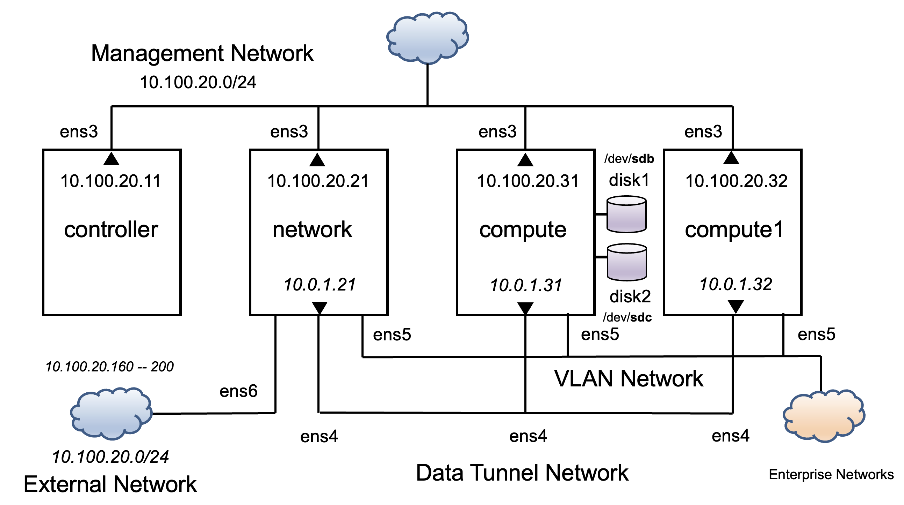
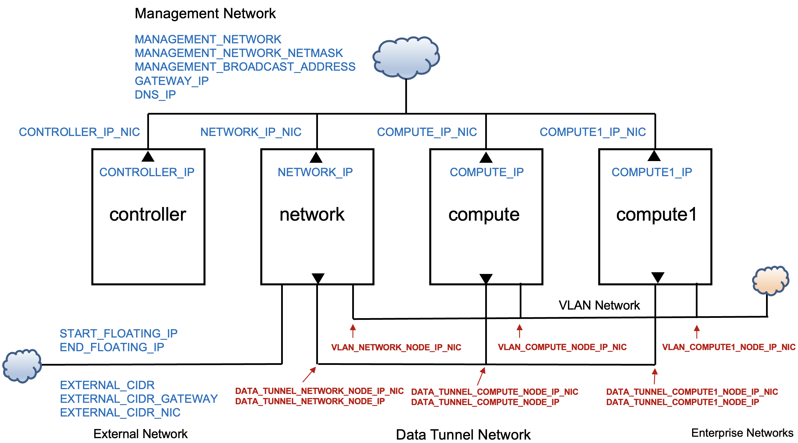
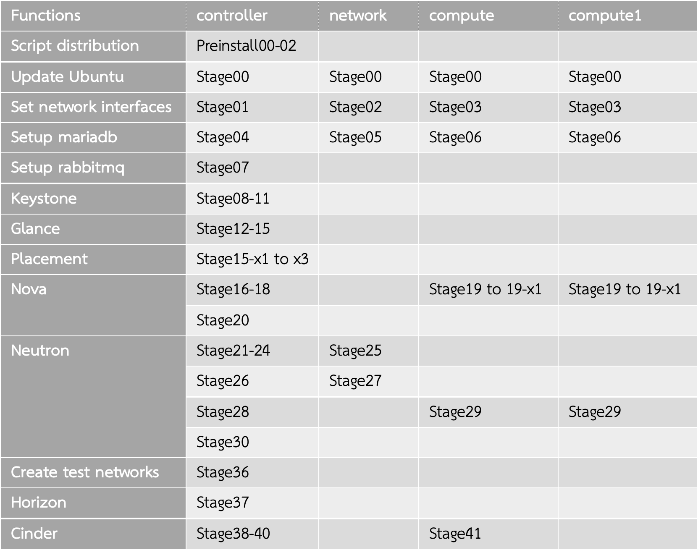

# openstack-victoria-basic-installer

Copyright 2021 Kasidit Chanchio 

Author: กษิดิศ ชาญเชี่ยว  
Contact: kasiditchanchio@gmail.com  

สคริปต์ได้รับการพัฒนาตามคู่มือติดตั้งระบบโอเพ่นสแตคที่ [1]

<h2> 1. การเตรียมคอมพิวเตอร์และระบบเครือข่ายสำหรับการติดตั้ง </h2>

ภาพ 1 โครงสร้างของเครื่องคอมพิวเตอร์และระบบเครือข่ายสำหรับติดตั้งระบบโอเพ่นสแตค  

ในการติดตั้งขอให้ผู้ติดตั้งเตรียมเครื่องคอมพิวเตอร์ที่ใช้ระบบปฏิบัติการอูบุนตูเวอร์ชั่น 20.04  (Ubuntu 20.04) จำนวน 4 เครื่องเชื่อมต่อกันด้วยระบบเครือข่ายดังภาพที่ 1 ซึ่งประกอบไปด้วยเครื่องคอมพิวเตอร์ชื่อคอนโทลเลอร์ (controller)  เน็ตเวริค์ (network) คอมพิวต์ (compute) และคอมพิวต์หนึ่ง (compute1) (โดยที่ชื่อเครื่องต้องได้รับการกำหนดในระบบปฏิบัติการอูบุนตูและเช็คได้ด้วยคำสั่ง hostname) จากภาพผู้เขียนแนะนำให้ใช้เครื่องคอนโทรเลอร์มีสแปคซิฟิเคชั่น (Specification) ขั้นต่ำสำหรับการศึกษาคือ ซีพียู (CPU) จำนวน 4 คอร์ หน่วยความจำขนาด 8 GB มีพื้นที่ดิสค์สำหรับเก็บข้อมูลขนาดอย่างน้อย 100 GB สำหรับเครื่องเน็ตเวิร์คควรมี ซีพียูจำนวน 2 คอร์ หน่วยความจำ 2 GB พื้นที่ดิสค์ 50 GB สำหรับเครื่องคอมพิวต์ และคอมพิวต์หนึ่ง แต่ละเครื่องควรมี ซีพียู 4 คอร์ หน่วยความจำ 8 GB พื้นที่ดิสค์ 100 GB ในกรณีที่ผู้อ่านต้องการติดตั้งเพื่อใช้งานจริง ผู้เขียนขอแนะนำให้ศึกษาคู่มือการใช้งานจริงที่ [2]

ระบบปฏิบัติการติดตั้งบนแต่ละเครื่องควรได้รับการอับเดท (update) ให้เป็นอูบุนตู 20.04 เวอร์ชั่นล่าสุดและกำหนดให้ทุกเครื่องมีล็อกอิน (login) ชื่อ “opensatck” และรหัสผ่าน (password) คือ “openstack” และล็อกอินนี้จะต้องสามารถใช้คำสั่ง sudo ได้ นอกจากนั้นระบบปฏิบัติการของทุกๆเครื่องควรได้รับการตั้งเวลาที่ใกล้เคียงกัน

ในภาพ 1 คอมพิวเตอร์ทั้งสี่เครื่องมีหน้าที่ต่อไปนี้ 
<ul>
  <li>เครื่องคอนโทรเลอร์ ทำหน้าที่รันซอฟต์แวร์ส่วนประกอบที่ทำหน้ารองรับคำสั่งจากผู้ใช้ระบบ พิสูจน์ตัวตนของผู้ใช้ บริหารจัดการการใช้งานทรัพยากร และเป็นที่ตั้งของระบบฐานข้อมูลที่ใช้เก็บเมต้าดาต้าของทั้งระบบ
  <li>เครื่องเน็ตเวิร์ค ทำหน้าที่จัดการการสื่อสารข้อมูลระหว่าง วีเอ็มภายในระบบโอเพ่นสแตคที่รันอยู่บนเครื่องคอมพิวต์ และคอมพิวต์หนึ่ง กับระบบเครือข่ายภายนอกระบบโอเพ่นสแตค เช่นเครือข่ายอินเตอร์เน็ต เป็นต้น 
  <li>เครื่องคอมพิวต์ และคอมพิวต์หนึ่ง เป็นเครื่องที่ทำหน้าที่รันวีเอ็มของผู้ใช้ โดยที่ซอฟต์แวร์ส่วนประกอบของโอเพ่นสแตคบนเครื่องคอนโทลเลอร์จะตัดสินใจว่าจะรันวีเอ็มของผู้ใช้บนเครื่องคอมพิวต์เครื่องไหน 
</ul>

  ในการติดตั้งที่จะได้กล่าวถึงต่อไปผู้ติดตั้งจะต้องจัดเตรียมระบบเครือข่ายที่มีการเชื่อมต่อเครื่องคอมพิวเตอร์ทั้งสี่เครื่องดังต่อไปนี้ 
<ul>
<li>	ระบบเครือข่ายบริหารจัดการ (Management Network) : เป็นระบบเครือข่ายสำหรับให้ซอฟต์แวร์ส่วนประกอบของโอเพ่นสแตคบนคอมพิวเตอร์ที่เกี่ยวข้องใช้สื่อสารคำสั่งและข้อมูลเพื่อดำเนินการฟังก์ชั่นการทำงานต่างๆของระบบฯ นอกจากนั้นเครือข่ายนี้ยังใช้สำหรับการติดตั้งซอฟต์แวร์ด้วย
  <li>	ระบบเครือข่าย ดาต้าทัลเนิล (Data Tunnel Network) : เป็นระบบเครือข่ายที่โอเพ่นสแตคใช้สำหรับสื่อสารข้อมูลระหว่างวีเอ็ม (VM) ที่อาจถูกกำหนดให้รันบนต่างเครื่องโฮส และใช้สำหรับสื่อสารข้อมูลระหว่างวีเอ็ม และเร้าเตอร์เสมือนที่โอเพ่นสแตคสร้างขึ้นบนเครื่องเน็ตเวิร์คโฮส เพื่อส่งผ่านข้อมูลของวีเอ็มออกสู่ระบบเครือข่ายภายนอกและส่งผ่านข้อมูลจากระบบเครือข่ายภายนอกต่อให้วีเอ็ม
    <li>	ระบบเครือข่าย วีแลน (VLAN Network) : เป็นระบบเครือข่ายที่อนุญาตให้วีเอ็มเชื่อมต่อเพื่อสื่อสารข้อมูลกับ แอพพลิเคชั่นดังเดิม (Legacy Applications) ขององค์กรที่ใช้ระบบเครือข่ายแบบวีแลนสื่อสารกันอยู่แล้ว 
      <li>	ระบบเครือข่ายภายนอก (External Network) : เป็นระบบเครือข่ายที่องค์กรที่ใช้ระบบโอเพ่นสแตคใช้บริการอินเทอร์เน็ต โดยที่องค์กรจะต้องจัดสรรหมายเลขไอพีจำนวนเพื่อให้วีเอ็มในระบบโอเพ่นสแตคใช้สื่อสารกับระบบเครือข่ายอินเทอร์เน็ต
</ul>

  จากตัวอย่างการจัดเตรียมทรัพยากรสำหรับการติดตั้งในภาพ 1 ผู้ติดตั้งจะต้องกำหนดค่าต่อไปนี้ด้วยตนเองก่อนทำการติดตั้ง
  <ul>
    <li>	กำหนดให้เครือข่ายบริหารจัดการมีค่าสับเน็ต (Subnet) คือ 10.100.20.0/24 </li>
    <li>	เครื่องคอนโทรเลอร์เชื่อมต่อกับเครือข่ายนี้ผ่าน เน็ตเวิร์คอินเตอร์เฟสการด์ (Network Interface Card) หรือนิคส์ (NIC) ชื่อ ens3 โดยกำหนดให้มีค่าไอพี 10.100.20.11 โดยใช้เน็ตแพลน (netplan) </li>
    <li>	กำหนดให้เครื่องเน็ตเวิร์ค เครื่องคอมพิวต์และ คอมพิวต์หนึ่ง เชื่อมต่อกับเครือข่ายบริหารฯผ่านนิคส์ ens3 และกำหนดให้ทั้งสามเครื่องมีค่าไอพีคือ 10.100.20.21 10.100.20.31 และ 10.100.20.32 ตามลำดับ </li>
    <li>	กำหนดให้เครื่องเน็ตเวิร์คมีนิคส์ที่เชื่อมต่อกับระบบเครือข่ายอื่นๆอีกสามเครือข่าย ได้แก่ 1) ens4 ที่เชื่อมต่อกับเครือข่ายดาต้าทันเนิล 2) ens5 ที่เชื่อมต่อกับระบบเครือข่ายวีแลน และ 3) ens6 ที่เชื่อมต่อเครื่องเน็ตเวิร์คกับระบบเครือข่ายภายนอก </li>
    <li>	สำหรับเครื่องคอมพิวต์และคอมพิวต์หนึ่งนั้น กำหนดให้ทั้งสองเครื่องใช้นิคส์ ens4 เชื่อมต่อกับระบบเครือข่ายดาต้าทัลเนิล และใช้นิคส์ ens5 เชื่อมต่อกับเครือข่ายวีแลน </li>
  </ul>
  ผู้ติดตั้งไม่ต้องกำหนดค่าไอพีอื่นๆในภาพ 1 ที่เป็นอักษรตัวเอียงด้วยตนเองเหมือนที่ทำกับ ens3 แต่จะต้องระบุค่าที่ไอพีที่ต้องการในไฟล์กำหนดค่าของซอฟต์แวร์สคริปต์สำหรับติดตั้ง ดังที่จะได้กล่าวถึงต่อไป

<h2> 2. การติดตั้งโดยใช้สคริปต์ </h2>

ผู้เขียนได้พัฒนาเชลสคริปต์สำหรับติดตั้งระบบโอเพ่นสแตคสามเวอร์ชั่นดังแสดงในตารางที่ 7-1 โดยอ้างอิงข้อมูลคำสั่งที่ใช้จากคู่มืออย่างเป็นทางการที่ [1] ในการติดตั้งที่จะบรรยายต่อไปผู้เขียนจะใช้สคริปต์สำหรับติดตั้งระบบโอเพ่นสแตคเวอร์ชั่นวิคทอเรียซึ่งเป็นเวอร์ชั่นที่เชื่อถือได้เพราะได้รับการเผยแพร่และมีการแก้ไขข้อผิดพลาดหลังเผยแพร่มาเป็นระยะเวลาหนึ่งแล้ว
ผู้ติดตั้งเริ่มการติดตั้งโดยล๊อกอินเข้าสู่เครื่องคอนโทรเลอร์ และเรียกใช้ screen เพื่อสร้าง screen session เพื่อป้องกันการสูญเสียการเชื่อมต่อจากคอมพิวเตอร์ที่ผู้ติดตั้งใช้มายังเครื่องคอนโทลเลอร์ในกรณีที่ผู้ติดตั้งรีโมทล็อกอินเข้าสู่เครื่องคอมโทรเลอร์ หลังจากนั้นผู้ติดตั้งจะใช้ git utility เพื่อดาวโหลดสคริปสำหรับติดตั้งจาก github มาสู่ไดเรคทอรี $HOME/openstack-victoria-basic-installer โดยที่ในตัวอย่างการติดตั้งนี้ $HOME คือ /home/openstack 
<pre>
On controller: 
$ screen
$ git init
$ git clone https://github.com/kasidit/openstack-victoria-basic-installer
Cloning into 'openstack-victoria-basic-installer'...
$ ls
openstack-victoria-basic-installer
</pre>
<pre>
Playlist: <a href="https://www.youtube.com/playlist?list=PLmUxMbTCUhr684_pVrjSZYgqmJX757pcp">https://www.youtube.com/playlist?list=PLmUxMbTCUhr684_pVrjSZYgqmJX757pcp</a>
Video 01: <a href="https://youtu.be/CKRYqGAQ5p0">https://youtu.be/CKRYqGAQ5p0</a>
</pre>

  หลังจากนั้นให้ cd เข้าสู่ openstack-victoria-basic-installer และลิสต์ชื่อไฟล์และสับไดเรคทอรี
<pre>
On controller: 
$ cd openstack-victoria-basic-installer/
$ ls
config.d     example.install-paramrc.sh  LICENSE                  Untarfiles
Deployments  exe-config-installer.sh     OPSInstaller-init.tar    vmhosts-scripts
documents    install-paramrc.sh          README.md
$ 
</pre>

ผู้ติดตั้งจะต้องแก้ไขไฟล์ install-paramrc.sh เพื่อกำหนดค่าพารามีเตอร์ (parameters) สำหรับการติดตั้ง ผู้เขียนจะนำเสนอพารามีเตอร์เป็นชุดๆ ซึ่งพารามีเตอร์ในแต่ละชุดมีความหมายดังต่อไปนี้
<ul>
  <li>	INSTALL_TYPE ระบุค่าชนิดของการติดตั้งสองแบบได้แก่ full หมายถึงติดตั้งบนเครื่องคอมพิวเตอร์ที่เตรียมไว้ทั้งสี่เครื่อง หรือ compact คือติดตั้งบนสามเครื่อง (ทุกเครื่องยกเว้นเครื่องคอมพิวต์หนึ่ง)
  <li>	NETWORK_TYPE ระบุชนิดของระบบเครือข่ายซึ่งกำหนดให้เป็น classic_ovs ซึ่งหมายถึงการเลือกใช้ระบบ openvswitch สำหรับสร้างระบบเครือข่ายเสมือนภายในระบบโอเพ่นสแตค
  <li>	PASSWD_TYPE คือการกำหนดค่ารหัสผ่านสำหรับซอฟต์แวร์ส่วนประกอบต่างๆของโอเพ่นสแตคซึ่ง studypass คือการใช้ชุดของรหัสผ่านที่เข้าใจได้เพื่อใช้ในการศึกษาการติดตั้ง ในขณะที่ randompass หมายถึงการกำหนดค่ารหัสผ่านด้วยการสุ่มค่าตัวเลขจำนวนเต็ม
</ul>
<pre>
On controller: 
$ vi install-paramrc.sh 
…
export INSTALL_TYPE=full
export NETWORK_TYPE=classic_ovs
export PASSWD_TYPE=studypass
</pre>
<ul>
  <li>	OPS_LOGIN_NAME และ OPS_LOGIN_PASS คือชื่อล๊อกอินและรหัสรหัสผ่านของแอคเค้าต์ (account) บนเครื่องคอมพิวเตอร์ที่เตรียมไว้สำหรับติดตั้งโอเพ่นสแตคทุกเครื่อง
  <li>	OPS_TIMEZONE คือการกำหนดค่าไทม์โซนสำหรับตั้งเวลาบนเครื่องคอมพิวเตอร์ที่เตรียมไว้ดังกล่าว
</ul>
<pre>
…
export OPS_LOGIN_NAME=openstack
export OPS_LOGIN_PASS=openstack
export OPS_TIMEZONE=Asia\\/Bangkok 
…
</pre>
<ul>
  <li>	OPS_MYSQL_PASS เป็นพารามีเตอร์สำหรับระบุค่ารหัสผ่านสำหรับรูท (root) แอคเค้าต์ของระบบฐานข้อมูลของโอเพ่นสแตค
  <li>	DEMO_PASS และ ADMIN_PASS ใช้สำหรับกำหนดค่ารหัสผ่านของผู้ใช้ตัวอย่าง (Demo user) และค่ารหัสผ่านของผู้ดูแลระบบโอเพ่นสแตคที่กำลังจะสร้างขึ้น
  <li>	HYPERVISOR เป็นพารามีเตอร์ที่กำหนดชนิดของซอฟต์แวร์ไฮเปอร์ไวเซอร์ที่ระบบโอเพ่นสแตคจะใช้สร้างวีเอ็ม มีสองแบบให้กำหนดได้แก่ 1) kvm ที่ผู้ติดตั้งจะกำหนดค่านี้ได้ก็ต่อเมื่อคอมพิวเตอร์ที่ระบบโอเพ่นสแตคจะรันวีเอ็มมีฮารด์แวร์ที่สนับสนุนการประมวลผลแบบเสมือร และ 2) qemu ที่สามารถสร้างวีเอ็มได้บนคอมพิวเตอร์ที่ไม่มีฮาร์ดแวร์สนับสนุนการประมวลผลแบบเสมือน
</ul>
<pre>
…
export OPS_MYSQL_PASS=mysqlpassword
export DEMO_PASS=demopassword
export ADMIN_PASS=adminpassword
#
export HYPERVISOR=kvm
…
</pre>
<ul>
  <li>	INIT_IMAGE_LOCATION เป็นที่ระบุค่ายูอาร์แอล (URL) ของไฟล์อิมเมจ (image) ของระบบลินุกส์ขนาดเล็กชื่อว่าระบบ cirros เพื่อใช้ทดสอบการสร้างและใช้งานวีเอ็มหลังจากติดตั้งระบบโอเพ่นสแตคเสร็จ
  <li>	INIT_IMAGE_NAME ชื่อของอิมเมจในข้อ 9
  <li>	DOMAINNAME คือโกเมน (domain) ของระบบเครือข่ายที่ใช้ติดตั้งระบบ
  <li>	NTP_SERVER0 ถึง NTP_SERVER3 เป็นการกำหนดชื่อ เซริฟเวอร์ที่ใช้อ้างอิงเวลาเอ็นทีพี (NTP Time Server) ซึ่งในที่นี้กำหนดค่าเซริฟเวอร์มาตรฐานไว้เป็นค่าดีฟอลต์ (Default)
</ul>
<pre>
…
export INIT_IMAGE_LOCATION=http:\\/\\/download.cirros-cloud.net\\/0.4.0\\/cirros-0.4.0-x86_64-disk.img
export INIT_IMAGE_NAME=cirros
#
export DOMAINNAME=cs.tu.ac.th
# ntp servers
export NTP_SERVER0=0.th.pool.ntp.org
export NTP_SERVER1=1.th.pool.ntp.org
export NTP_SERVER2=2.th.pool.ntp.org
export NTP_SERVER3=3.th.pool.ntp.org
…
</pre>

ภาพ 2 แผนภาพแสดงพารามีเตอร์เกี่ยวกับระบบเครือข่ายสำหรับการติดตั้งระบบโอเพ่นสแตค

ถัดจากนั้นจะเป็นการกำหนดค่าของระบบเครือข่ายที่จำเป็นต้องใช้ในการติดตั้งโอเพ่นสแตค ภาพ 7-2 แสดงความเกี่ยวข้องของตัวแปรต่างๆในไฟล์ install_paramrc.sh กับโครงสร้างของคอมพิวเตอร์และระบบเครือข่ายที่รองรับการติดตั้งระบบโอเพ่นสแตค
<ul>
  <li>	MANAGEMENT_NETWORK_NETMASK และ MANAGEMENT_NETWORK และ MANAGEMENT_NETWORK_BROADCAST_ADDRESS เป็นพารามีเตอร์สำหรับกำหนดค่าระบบเครือข่ายบริหารจัดการของระบบโอเพ่นสแตค
  <li>	DNS_IP เป็นการกำหนดค่าไอพีของ ดีเอ็นเอส เซริฟเวอร์ (DNS server)
  <li>	CONTROLLER_IP และ CONTROLLER_IP_NIC คือพารามีเตอร์ค่าไอพีและชื่อนิคส์ของเครื่องคอมโทรเลอร์บนระบบเครือข่ายบริหารจัดการ
  <li>	GATEWAY_IP เป็นการระบุค่าไอพีของเร้าเตอร์เกตเวย์ (router gateway) ของระบบเครือข่ายบริหารจัดการ 
  <li>	NETWORK_IP และ NETWORK_IP_NIC คือพารามีเตอร์ค่าไอพีและชื่อนิคส์ของเครื่องเน็ตเวิร์คบนระบบเครือข่ายบริหารจัดการ
</ul>
<pre>
export MANAGEMENT_NETWORK_NETMASK=255.255.255.0
export MANAGEMENT_NETWORK=10.100.20.0
export MANAGEMENT_BROADCAST_ADDRESS=10.100.20.255 
export DNS_IP=8.8.8.8
…
export CONTROLLER_IP=10.100.20.11
export CONTROLLER_IP_NIC=ens3
export GATEWAY_IP=10.100.20.1
…
export NETWORK_IP=10.100.20.21
export NETWORK_IP_NIC=ens3
</pre>
<ul>
  <li>	DATA_TUNNEL_NETWORK_NODE_IP และ DATA_TUNNEL_NETWORK_NODE_IP_NIC เป็นการระบุค่าไอพีและชื่อนิคส์ที่เครื่องเน็ตเวิร์คใช้เชื่อมต่อกับระบบเครือข่ายดาต้าทัลเนิล
  <li>	DATA_TUNNEL_NETWORK_ADDRESS และ DATA_TUNNEL_NETWORK_NETMASK เป็นการระบุค่าสับเน็ตของระบบเครือข่ายดาต้าทัลเนิล
</ul>
<pre>
export DATA_TUNNEL_NETWORK_NODE_IP=10.0.1.21
export DATA_TUNNEL_NETWORK_NODE_IP_NIC=ens4
export DATA_TUNNEL_NETWORK_ADDRESS=10.0.1.0
export DATA_TUNNEL_NETWORK_NETMASK=255.255.255.0
</pre>
<ul>
  <li>	VLAN_NETWORK_NODE_IP_NIC เป็นพารามีเตอร์ที่ระบุว่าเครื่องเน็ตเวิร์คเชื่อมต่อกับระบบเครือข่าววีแลนผ่านนิคส์ใด
  <li>	EXTERNAL_CIDR และ EXTERNAL_CIDR_NIC เป็นการระบุค่าสับเน็ตของระบบเครือข่ายภายนอกที่เครื่องเน็ตเวิร์คเชื่อมต่อและชื่อของนิคส์ที่เชื่อมต่อระบบเครือข่ายดังกล่าว
  <li>	EXTERNAL_GATEWAY_IP เป็นพรามีเตอร์ที่ระบุค่าไอพีของเร้าเตอร์เกตเวย์ของระบบเครือข่ายถายนอก
  <li>	START_FLOATING_IP และ END_FLOATING_IP เป็นการระบุชุดบล้อค (block) ของค่าไอพีจากระบบเครือข่ายภายนอกที่ระบบโอเพ่นสแตคสามารถนำไปใช้เพื่อเป็นค่าไอพีของวีเอ็มที่ระบบฯสร้างขึ้นเพื่อที่จะทำให้วีเอ็มนั้นสามารถปฏิบัติงานเป็นเซริฟเวอร์ให้คอมพิวเตอร์เครื่องอื่นติดต่อผ่านระบบเครือข่ายภายนอกได้
</ul>
<pre>
export VLAN_NETWORK_NODE_IP_NIC=ens5
…
export EXTERNAL_CIDR=10.100.20.0\\/24
export EXTERNAL_CIDR_NIC=ens6
export EXTERNAL_GATEWAY_IP=10.100.20.1
…
export START_FLOATING_IP=10.100.20.160
export END_FLOATING_IP=10.100.20.200
</pre>
<ul>
  <li>	COMPUTE_IP และ COMPUTE_IP_NIC เป็นพารามีเตอร์เพื่อระบุค่าไอพีและนิคส์ของเครื่องคอมพิวต์ที่เชื่อมต่อกับระบบเครือข่ายบริหารจัดการ
  <li>	DATA_TUNNEL_COMPUTE_NODE_IP และ DATA_TUNNEL_COMPUTE_NODE_IP_NIC เป็นการระบุค่าไอพีและนิคส์ที่เครื่องคอมพิวต์ใช้เชื่อมต่อกับระบบเครือข่ายดาต้าทัลเนิล
  <li>	VLAN_COMPUTE_NODE_IP_NIC เป็นการระบุชื่อของนิคส์ของเครื่องคอมพิวต์ที่ใช้เชื่อมต่อกับระบบเครือข่ายวีแลน ผู้ติดตั้งไม่จำเป็นต้องกำหนดค่าไอพีสำหรับนิคส์นี้
</ul>
<pre>
export COMPUTE_IP=10.100.20.31
export COMPUTE_IP_NIC=ens3
export DATA_TUNNEL_COMPUTE_NODE_IP=10.0.1.31
export DATA_TUNNEL_COMPUTE_NODE_IP_NIC=ens4
export VLAN_COMPUTE_NODE_IP_NIC=ens5
</pre>
<ul>
  <li>	COMPUTE1_IP จนถึง VLAN_COMPUTE1_NODE_IP_NIC เป็นการระบุค่าแบบเดียวกับข้อ 12 ถึง 14 สำหรับเครื่องคอมพิวต์หนึ่ง
</ul>
<pre>
export COMPUTE1_IP=10.100.20.32
export COMPUTE1_IP_NIC=ens3
export DATA_TUNNEL_COMPUTE1_NODE_IP=10.0.1.32
export DATA_TUNNEL_COMPUTE1_NODE_IP_NIC=ens4
export VLAN_COMPUTE1_NODE_IP_NIC=ens5
</pre>

  หลังจากที่ผู้ติดตั้งระบุค่าในไฟล์ install-paramrc.sh แล้ว ผู้ติดตั้งต้องรันสคริปต์ ./exe-config-installer.sh เพื่อสร้างสคริปต์จำนวนหนึ่งที่ได้รับการแทนค่าพารามีเตอร์ต่างๆให้พร้อมสำหรับการติดตั้ง
<pre>
On controller: 
$ pwd
/home/openstack/openstack-victoria-basic-installer
$ ./exe-config-installer.sh
</pre>

  สคริปต์ ./exe-config-installer.sh จะสร้างไดเรคทอรี่ OPSInstaller ขึ้นมาบนเครื่องคอนโทรเลอร์ ภายในไดเรคทอรี่นั้นจะมีไดเรคทอรี่ย่อยที่มีสคริปต์และไฟล์กำหนดค่า (configuration files) สำหรับเครื่องที่จะติดตั้งโอเพ่นสแตคแต่ละเครื่อง ยกตัวอย่างเช่น ไดเรคทอรี่ย่อย controller จะประกอบไปด้วยสคริปต์และไฟล์กำหนดค่าที่ได้รับการระบุค่าพารามีเตอร์แล้วสำหรับการติดตั้งบนเครื่องคอมโทรเลอร์ เป็นต้น 
<pre>
On controller:
$ cd OPSInstaller/
$ ls
compute                   newcompute
compute1                  remove-all-except-compute1.sh
controller                remove-all-except-compute.sh
Deploy-1node-controller   remove-all-except-controller.sh
Deploy-2nodes-compute     remove-all-except-network.sh
Deploy-2nodes-controller  remove-all-except-newcompute.sh
installer                 replace-newcompute-genericnames.sh
network                   scriptmap.html
$
</pre>

ตารางที่ 1 โครงสร้างและหน้าที่ของสคริปต์สำหรับช่วยติดตั้งระบบโอเพ่นสแตคที่จะต้องรันบนเครื่องคอนโทรเลอร์ เครื่องเน็ตเวิร์ค เครื่องคอมพิวต์ และเครื่องคอมพิวต์หนึ่ง

  ตารางที่ 1 แสดงโครงสร้างของสคริปต์ที่ถูกสร้างขึ้นที่จะได้รับการกระจายไปยังเครื่องคอนโทรเลอร์ เครื่องเน็ตเวิร์ค เครื่องคอมพิวต์และเครื่องคอมพิวต์หนึ่ง ชื่อของสคริปต์แต่ละสคริปต์จะมีชุดตัวอักษร “*StageNN*” ซึ่ง NN เป็นตัวเลขระบุอันดับของการเรียกใช้ ในตารางผู้เขียนจะแทนสคริปต์แต่ละสคริปต์ด้วยชุดตัวอักษร “StageNN” แทนที่จะเป็นชื่อทั้งหมด สคริปต์เหล่านี้จะถูกจัดเป็นกลุ่มซึ่งแต่ละกลุ่มจะทำ “หน้าที่” ดังที่ระบุในคอลัมน์ “Functions” ยกตัวอย่างเช่นสคริปต์ในทุกคอลัมน์ที่อยู่ในบรรทัดที่ค่าของ “Functions” คือ “Nova” คือสคริปต์สำหรับติดตั้งซอฟต์แวร์โนวาของระบบโอเพ่นสแตค คอลัมน์ในตารางถัดจาก “Functions” ก็คือชื่อของเครื่องคอมพิวเตอร์ที่ผู้ติดตั้งจะรันสคริปต์ “StageNN” บนเครื่องเหล่านั้น ยกตัวอย่างเช่น “Stage21-24” ในคอลัมน์ “controller” หมายถึง ผู้ติดตั้งจะต้องรันสคริปต์ที่มีชุดอักษร “Stage21” “Stage22” “Stage23” และ “Stage24” ในชื่อสคริปต์ บนเครื่องคอนโทรเลอร์

  ในการรันสคริปต์ มีข้อกำหนดและข้อเสนอแนะต่อไปนี้ 
<ul>
  <li>ข้อกำหนด ถ้าชื่อสคริปต์มีชุดอักษร “SUDO” ก็จะต้องใช้ sudo ในการรัน และถ้ามี “USER” ก็ต้องรันแบบผู้ใช้ธรรมดา ผู้ติดตั้งควรระวังและไม่ควรใช้ sudo กับ script ที่มีคำว่า “USER” อยู่ในชื่อ (หรือในทางกลับกัน) เพราะจะทำให้การติดตั้งผิดพลาดได้
  <li>ข้อเสนอแนะ เพื่อเพิ่มความสะดวกในการติดตั้ง ผู้ติดตั้งควรจะกำหนดค่าใน /etc/sudoers ให้การใช้คำสั่ง sudo ของยูเซอร์แอคเค้าต์ “openstack” บนทุกเครื่องสามารถทำได้โดยไม่ต้องป้อนรหัสผ่าน
</ul>
ในอันดับถัดไป ผู้เขียนจะบรรยายถึงการใช้สคริปต์ในตารางเป็นกลุ่มตามหน้าที่ของสคริปต์ดังตาราง 1

 <h3> 1 การกระจายสคริปต์และไฟล์กำหนดค่าไปยังเครื่องที่จะติดตั้ง (Script distribution)</h3>

	ไดเรคทอรี่ย่อย installer บรรจุสคริปต์ที่ใช้สำหรับการกระจายไฟล์และข้อมูลสำหรับการติดตั้งไปยังเครื่องที่จะติดตั้งระบบฯแต่ละเครื่อง ผู้ติดตั้งจะต้อง cd เข้าสู่ installer และรันสคริปต์สามสคริปต์ดังนี้ 1) sudo ./exe-preinstall00-SUDO-update.sh เพื่อติดตั้งซอฟต์แวร์สำหรับกระจายข้อมูล และ 2) ./exe-preinstall01-USER-set-remote-access.sh เพื่อกำหนดค่า private key และ public key เพื่อให้สามารถรีโมทเอ็กซีคิวชั่นและถ่ายโอนข้อมูลได้โดยไม่ต้องระบบรหัสผ่าน และ 3) ./exe-preinstall02-USER-set-openstack-nodes.sh เป็นสคริปต์ที่รวมคำสั่งสำหรับถ่ายโอนสคริปต์และไฟล์กำหนดค่าในรูปของทาร์บอล (tarball) ไปยังเครื่องที่จะติดตั้งทุกเครื่องและออกคำสั่งให้อันทาร์ (untar) สคริปต์และไฟล์ดังกล่าวบนเครื่องเหล่านั้น 
<pre>
On controller: 
$ cd installer
$ pwd
/home/openstack/openstack-wallaby-basic-installer/OPSInstaller/installer
$ sudo ./exe-preinstall00-SUDO-update.sh
$ ./exe-preinstall01-USER-set-remote-access.sh
$ ./exe-preinstall02-USER-set-openstack-nodes.sh
</pre>
<pre>
Video 02: <a href="https://youtu.be/k4zK2FWSKXo">https://youtu.be/k4zK2FWSKXo</a>
</pre>

สคริปต์สำหรับติดตั้งโอเพ่นสแตคจะได้รับการอันทาร์ไว้ในไดเรคทอรี่ $HOME/OPSInstaller ของแต่ละเครื่อง (ซึ่งจากข้อกำหนดว่าแอคเค้าที่จะใช้ติดตั้งโอเพ่นสแตคบนแต่ละเครื่องมีชื่อว่า “openstack” ค่า $HOME ในที่นี้จะหมายถึงไดเรคทอรี่ /home/openstack)

<h3>2 การอัปเดตอูบุนตูและโอเพ่นสแตครีโพสิทอรี่ (Updating Ubuntu Repository)</h3>

	ในอันดับถัดไป ผู้ติดตั้งจะต้องล๊อกอินเข้าสู่เครื่องคอนโทรเลอร์และ cd จากไดเรคทอรี่ $HOME เข้าสู่ไดเรคทอรี่ย่อย OPSInstaller/controller เพื่อรันสคริปต์เพื่อกำหนดค่ารีโพสิทอรี่ (Repository) ของระบบปฏิบัติการอูบุนตูลินุกซ์และอัปเดทระบบอูบุนตู 20.04 ให้พร้อมที่จะดาวน์โหลดและติดตั้งซอฟต์แวร์แพคเกจ (Ubuntu packages) จากรีโพสิทอรี่นั้น ในการกำหนดค่ารีพสิทอรี่ ซอฟต์แวร์เอพีที (APT) ของอูบุนตูจะรอให้ผู้ใช้กดเอนเตอร์ (ENTER) เพื่อให้แน่ใจว่ารีโพสิทอรี่นั้นถูกต้อง และหลังจากนั้นจะใช้เวลาในการติดตั้งพอสมควรขึ้นอยู่กับความเร็วในการดาวน์โหลดแพคเกจ และความเร็วในการอ่านเขียนหน่วยเก็บข้อมูล (storage) ของเครื่องที่ติดตั้ง 

  เมื่อจบการติดตั้งบนเครื่องคอนโทรเลอร์แล้ว ผู้ติดตั้งจะต้องรีบูทเครื่อง
<pre>
On controller: 
$ cd
$ cd OPSInstaller/controller/
$ sudo ./exe-stage00-SUDO-update.sh
…
Press [ENTER] to continue or Ctrl-c to cancel adding it.
…
update-initramfs: Generating /boot/initrd.img-5.4.0-58-generic 

… จะใช้เวลาระยะหนึ่ง …
$
$ sudo reboot
</pre>
<pre>
Video 03: <a href="https://youtu.be/0-xmtc00dLw">https://youtu.be/0-xmtc00dLw</a>
</pre>

  เนื่องจากผู้ติดตั้งจะต้องรันสคริปต์ exe-stage00-SUDO-update.sh บนทุกเครื่องและสคริปต์ใช้เวลารันนาน ดังนั้นผู้ติดตั้งควรรันสคริปต์บนทุกเครื่องพร้อมๆกัน หมายเหตุ:สคริปต์จะออกคำสั่งรีบูทโดยอัตโนมัติเมื่อจบการประมวลผลบนเครื่องเน็ตเวิร์ค เครื่องคอมพิวต์ และเครื่องคอมพิวต์หนึ่ง
<pre>
On network: 
$ cd OPSInstaller/network/
$ sudo ./exe-stage00-SUDO-update.sh
…
On compute: 
$ cd OPSInstaller/network/
$ sudo ./exe-stage00-SUDO-update.sh
…
On compute1: 
$ cd OPSInstaller/network/
$ sudo ./exe-stage00-SUDO-update.sh
…
</pre>

<h3>3 การกำหนดการเชื่อมต่อระบบเครือข่าย (Setting up Network Interfaces)</h3>

  หลังจากที่ทุกเครื่องได้รับการรีบูทแล้ว ผู้ติดตั้งจะต้องรันสคริปต์บนเครื่องคอนโทรเลอร์เพื่อกำหนดค่าไอพีและแอคติเวท (Activate) นิคส์ที่โอเพ่นสแตคต้องใช้บนเครื่องที่จะติดตั้งทุกเครื่องดังภาพ 1 ในอันดับแรกผู้ติดตั้งจะต้องล็อกอินเข้าสู่เครื่องคอนโทรเลอร์ cd เข้าสู่ไดเรคทอรี่ OPSInstaller/controller/ และรันสคริปต์ exe-stage01-SUDO-preinstall.sh ซึ่งจะกำหนดค่าในไฟล์ /etc/network/interfaces และไฟล์ /etc/hosts 

	<b>หมายเหตุ:</b> ผู้ติดตั้งควรสร้างสกรีนแซสชั่น (screen session) ไว้บน<b>ทุกเครื่องที่ผู้ติดตั้งล็อกอินเข้าใช้งานโดยตรง</b>จากเครื่องโลคอลคอมพิวเตอร์ (Local computer) เช่นโน๊ตบุ้คคอมพิวเตอร์ หรือเดสค์ท้อปคอมพิวเตอร์ของผู้ติดตั้ง เพื่อป้องกันกรณีเน็ตเวิร์คขาดการเชื่อมต่อ (network disconnection) ในระหว่างติดตั้ง ขอให้ศึกษาการใช้งานสกรีนยูทิลิตี้ (screen utility) ด้วยตนเอง
<pre>
On controller: 
$ screen
$ cd OPSInstaller/controller/
$ sudo ./exe-stage01-SUDO-preinstall.sh
$ 
</pre>
<pre>
Video 04: <a href="https://youtu.be/xA9bMdL4yKE">https://youtu.be/xA9bMdL4yKE</a>
</pre>
บนเครื่องเน็ตเวิร์ค ให้ cd ไปที่ OPSInstaller/network และรันสคริปต์ exe-stage02-SUDO-network-preinstall.sh ซึ่งจะรายงานเอ้าพุทต์เป็นรายการของนิคส์ที่ได้รับการกำหนดค่าไอพีได้แก่นิคส์ ens3 และ ens4 และที่ไม่มีค่าไอพีแต่ถูกแอคติเวทสำหรับให้โอเพ่นสแตคใช้ได้แก่ ens5 และ ens6 
<pre>
On network: 
$ cd OPSInstaller/network/
$ sudo ./exe-stage02-SUDO-network-preinstall.sh
…
ens3: flags=4163<UP,BROADCAST,RUNNING,MULTICAST>  mtu 1500
        inet 10.100.20.21  netmask 255.255.255.0  broadcast 10.100.20.255
…
ens4: flags=4163<UP,BROADCAST,RUNNING,MULTICAST>  mtu 1500
        inet 10.0.1.21  netmask 255.255.255.0  broadcast 10.0.1.255
…
ens5: flags=4163<UP,BROADCAST,RUNNING,MULTICAST>  mtu 1500
        inet6 fe80::281:50ff:fe00:393  prefixlen 64  scopeid 0x20<link>
…
ens6: flags=4163<UP,BROADCAST,RUNNING,MULTICAST>  mtu 1500
        inet6 fe80::281:50ff:fe00:493  prefixlen 64  scopeid 0x20<link>
…
$ 
</pre>
บนเครื่องคอมพิวต์ ให้ทำคล้ายกับบนเครื่องเน็ตเวิร์ค เพื่อรันสคริปต์ exe-stage03-SUDO-compute-preinstall.sh ซึ่งจะให้ผลลัพธ์คล้ายกับการรันสคริปต์บนเครื่องเน็ตเวิร์ค 
<pre>
On compute: 
$ cd OPSInstaller/compute/
$ sudo ./exe-stage03-SUDO-compute-preinstall.sh
…
ens3: flags=4163<UP,BROADCAST,RUNNING,MULTICAST>  mtu 1500
        inet 10.100.20.31  netmask 255.255.255.0  broadcast 10.100.20.255
...
ens4: flags=4163<UP,BROADCAST,RUNNING,MULTICAST>  mtu 1500
        inet 10.0.1.31  netmask 255.255.255.0  broadcast 10.0.1.255
...
ens5: flags=4163<UP,BROADCAST,RUNNING,MULTICAST>  mtu 1500
        inet6 fe80::281:50ff:fe00:394  prefixlen 64  scopeid 0x20<link>
...
ens6: flags=4163<UP,BROADCAST,RUNNING,MULTICAST>  mtu 1500
        inet6 fe80::281:50ff:fe00:494  prefixlen 64  scopeid 0x20<link>
 …
$ 
</pre>
บนเครื่องคอมพิวต์หนึ่ง ทำเช่นเดียวกันกับที่ทำบนเครื่องคอมพิวต์ 
<pre>
On compute1: 
$ cd OPSInstaller/compute1/
$ sudo ./exe-stage03-SUDO-compute-preinstall.sh
ens3: flags=4163<UP,BROADCAST,RUNNING,MULTICAST>  mtu 1500
        inet 10.100.20.32  netmask 255.255.255.0  broadcast 10.100.20.255
...
ens4: flags=4163<UP,BROADCAST,RUNNING,MULTICAST>  mtu 1500
        inet 10.0.1.32  netmask 255.255.255.0  broadcast 10.0.1.255
...
ens5: flags=4163<UP,BROADCAST,RUNNING,MULTICAST>  mtu 1500
        inet6 fe80::281:50ff:fe00:395  prefixlen 64  scopeid 0x20<link>
...
ens6: flags=4163<UP,BROADCAST,RUNNING,MULTICAST>  mtu 1500
        inet6 fe80::281:50ff:fe00:495  prefixlen 64  scopeid 0x20<link>
…
$ 
</pre>

<h3>4 ติดตั้งระบบฐานข้อมูลมาเรียดีบี mariadb และกำหนดค่าเริ่มต้น (Setting up mariadb)</h3>

ระบบโอเพ่นสแตคใช้ระบบฐานข้อมูลมาเรียดีบี mariadb [3] ซึ่งเป็นระบบฐานข้อมูลแบบโอเพ่นซอร์สที่โอเพ่นสแตคใช้เก็บข้อมูลเมตาดาต้า (metadata) ผู้ติดตั้งต้องรันสคริปต์ exe-stage04-SUDO-mysql.sh บนเครื่องคอนโทรเลอร์ ซึ่งสคริปต์จะทำหน้าที่ต่อไปนี้ 
<ul>
  <li>	ใช้ซอฟต์แวร์โครนี่ (chronyc) ซิงค์โครไนซ์ (synchronize) เวลากับเอ็นทีพีเซริฟเวอร์ 
  <li>	ติดตั้งระบบฐานข้อมูลมาเรียดีบี โดยที่หลังจากติดตั้งสคริปต์จะรันคำสั่ง mysql_secure_installation เพื่อให้ผู้ติดตั้งกำหนดค่าเริ่มต้นให้กับระบบฐานข้อมูล ขอให้ผู้ติดตั้งดูรายละเอียดการป้อนข้อมูลตามรายละเอียดข้างล่าง (ในกรณีที่มีคำถามเพิ่มมากกว่าที่แสดงข้างล่างได้แก่ คำถามเกี่ยวกับการเปลี่ยนการเข้าถึง sql เซริฟเวอร์ด้วย UNIX Socket ขอให้ตอบ Yes)
</ul>
<pre>
On controller: 
$ pwd
/home/openstack/OPSInstaller/controller
$ sudo ./exe-stage04-SUDO-mysql.sh
…
*** First, enter blank for mysql password. Then set new password to mysqlpassword ***
…
Enter current password for root (enter for none): กด enter
…
Change the root password? [Y/n] ใส่ Y
…
New password: mysqlpassword
Re-enter new password: mysqlpassword
…
Remove anonymous users? [Y/n] ใส่ y
…
Disallow root login remotely? [Y/n] ใส่ y
…
Remove test database and access to it? [Y/n] ใส่ y
…
Reload privilege tables now? [Y/n] ใส่ y
…
$ 
</pre>
<pre>
Video 05: <a href="https://youtu.be/QJoHuwriN58">https://youtu.be/QJoHuwriN58</a>
Video 06: <a href="https://youtu.be/a5btD1shM1c">https://youtu.be/a5btD1shM1c</a>
</pre>
ถัดไป บนเครื่องเน็ตเวิร์ค ให้รันสคริปต์ exe-stage05-SUDO-network-mysql.sh ดังคำสั่งข้างล่าง สคริปต์จะรันซอฟต์แวร์โครนี่เพื่อซิงโครไนซ์เวลากับเครื่องคอนโทรเลอร์ หลังจากนั้นให้ล็อกอินเข้าสู่เครื่องคอมพิวต์และคอมพิวต์หนึ่งเพื่อรันสคริปต์ exe-stage06-SUDO-compute-mysql.sh ซึ่งจะทำเช่นเดียวกันกับสคริปต์ที่เพิ่งรันบนเครื่องเนตเวิร์ค 
<pre>
On network: 
$ cd OPSInstaller/network/
$ sudo ./exe-stage05-SUDO-network-mysql.sh
$ 
...
On compute: 
$ cd OPSInstaller/compute/
$ sudo ./exe-stage06-SUDO-compute-mysql.sh
$ 
...
On compute1: 
$ cd OPSInstaller/compute1/
$ sudo ./exe-stage06-SUDO-compute-mysql.sh
$ 
</pre>

<h3>5 ติดตั้งระบบสื่อสารแรบบิทเอ็มคิว (Setting up rabbitmq)</h3>

ระบบโอเพ่นสแตกใช้ซอฟต์แวร์แรบบิทเอ็มคิว rabbitmq [6] ซึ่งเป็นซอฟต์แวร์แบบโอเพ่นซอร์สที่ปฏิบัติงานเป็นแมสเสจ-โบรคเกอร์ (Message-Broker) ที่รองรับการสื่อสารข้อมูลของโปรโตคอลจัดการคิวข้อความขั้นสูง (Advanced Message Queue Protocol) หรือ เอเอ็มคิวพี (AMQP) และโปรโตคอลอื่นๆ อาทิเช่น เอสทีโอเอ็มพี (STOMP) และ เอ็มคิวทีที (MQTT) เป็นต้น โอเพ่นสแตกใช้ซอฟต์แวร์นี้สื่อสารคำสั่งและข้อมูลระหว่างซอฟต์แวร์ส่วนประกอบต่างที่อาจอยู่บนโฮสเครื่องเดียวกันหรือต่างเครื่องกัน 

	ต่อจากการติดตั้งมาเรียดีบี ผู้ติดตั้งจะต้องรันสคริปต์ exe-stage07-SUDO-rabbit.sh เพื่อติดตั้งแรบบิทเอ็มคิวบนเครื่องคอนโทรเลอร์
<pre>
On controller: 
$ sudo ./exe-stage07-SUDO-rabbit.sh
</pre>
<pre>
Video 07: <a href="https://youtu.be/awlGBHDcR0M">https://youtu.be/awlGBHDcR0M</a>
</pre>

<h3>6 ติดตั้งคีย์สโตน (Keystone Installation)</h3>

คีย์สโตน (keystone) คือซอฟต์แวร์คอมโพเน้น (component) ของระบบโอเพ่นสแตคที่ทำหน้าที่ตรวจสอบตัวตนและกำหนดสิทธิ์การใช้งานของผู้ใช้ ผู้ติดตั้งต้องรันสคริปต์บนเครื่องคอนโทรเลอร์ ได้แก่สคริปต์ exe-stage08-SUDO-keystone-database.sh เพื่อสร้างเทเบิ้ล (Tables) ในมาเรียดีบีที่คีย์สโตนต้องใช้ และสคริปต์ exe-stage09-SUDO-keystone.sh เพื่อติดตั้งซอฟต์แวร์เพจเกจสำหรับรันคีย์สโตน
<pre>
On controller: 
$ sudo ./exe-stage08-SUDO-keystone-database.sh
$ sudo ./exe-stage09-SUDO-keystone.sh
</pre>
<pre>
Video 08: <a href="https://youtu.be/VSFFFQY89dE">https://youtu.be/VSFFFQY89dE</a>
</pre>

หลังจากนั้นผู้ติดตั้งจะ 1) สร้างเซอร์วิสโปรเจค (Service Project) เพื่อเตรียมให้บริการพิสูจน์ตัวตนและสิทธิการใช้งานของคีย์สโตนแก่เซอร์วิสต่างๆของระบบโอเพ่นสแตคที่จะได้รับารติดตั้งต่อไป โดยรันสคริปต์ exe-stage10-USER-service-endpoints.sh และ 2) ทดสอบคีย์สโตนโดยรันสคริปต์ exe-stage11-USER-test-envscript.sh 

หมายเหตุ: ขอให้สังเกตว่าผู้ติดตั้งต้องรันสคริปต์ทั้งสองโดยใช้ยูเซอร์แอคเค้าต์ธรรมดา (ยูเซอร์ openstack) เนื่องจากชื่อสคริปต์มีชุดอักษร “USER” อยู่ในนั้น หากผู้ติดตั้งใช้ sudo จะเกิดความผิดพลาดขึ้นในการรันสคริปต์ในอนาคต
<pre>
On controller: 
$ ./exe-stage10-USER-service-endpoints.sh
$ ./exe-stage11-USER-test-envscript.sh
</pre>
<pre>
Video 09: <a href="https://youtu.be/TT5z0rMfI-8">https://youtu.be/TT5z0rMfI-8</a>
</pre>

<h3>7 ติดตั้งแกล๊นซ์ (Glance Installation)</h3>

แกล๊นซ์ (glance) (หรือ โอเพ่นสแตค อิมเมจ) (OpenStack Image) เป็นซอฟต์แวร์คอมโพเน้นของโอเพ่นสแตคที่ทำหน้าที่เก็บ เทมแพลต (Template) ของดิสค์อิมเมจของระบบปฏิบัติการที่จะใช้เป็นเกสท์โอเอส (Guest OS) ของวีเอ็ม ยกตัวอย่างเช่นถ้าผู้ติดตั้งต้องการให้ระบบโอเพ่นสแตคสามารถรันวีเอ็มที่มีเกสโอเอสเป็น วินโดวส์ 10 (Windows 10) หรือ เรดแฮท เอนเตอร์ไพร์ซลินุกส์ (Redhat Enterprise Linux) หรือ อูบุนตู เวอร์ชั่น 20.04 เป็นต้น ผู้ติดตั้งจะต้องนำเข้าเทมเพลตของดิสค์อิมเมจของเกสโอเอสเหล่านั้นในระบบแกล๊นซ์ 

ในการติดตั้ง ผู้ติดตั้งจะต้องรัน 1) สคริปต์ exe-stage12-SUDO-glance-database.sh เพื่อสร้างเทเบิ้ลสำหรับการประมวลผลของแกล๊นซ์ในระบบฐานข้อมูล 2) สคริปต์ exe-stage13-USER-glance-endpoints.sh เพื่อสร้างยูอาร์แอลสำหรับให้บริการแกล๊นซ์ (glance endpoints) เพื่อให้ซอฟต์แวร์อื่นติดต่อแกล๊นซ์ได้ 3) สคริปต์ exe-stage14-SUDO-glance.sh และ exe-stage14-x1-SUDO-glance.sh เพื่อติดตั้งซอฟต์แวร์เพคเกจของแกล๊นซ์ และ 4) สคริปต์ exe-stage15-USER-verify-glance.sh เพื่อทดสอบแกล๊นซ์ โดยจะดาวน์โหลด ดิสค์อิมเมจของระบบปฏิบัติการเซอร์รอส (cirros) ดังที่ระบุในไฟล์ install_paramrc.sh ถ้าสคริปต์ดาวน์โหลดสำเร็จ ดิสค์อิมเมจนั้นจะได้รับการนำเข้าไปเก็บใน ดิสค์เทมแพลตรีโพสิทอรี่ของระบบแกล๊นซ์ (ในกรณีที่ดาวน์โหลดไม่สำเร็จ อาจมีสาเหตุเนี่องมาจากการป้องกันการโจมตีแบบดีดีโอเอส (DDOS) ของเว็ปไซต์ของเซอร์รอส ขอให้ผู้ติดตั้งรอสักระยะหนึ่งแล้วลองดาวน์โหลดอิมเมจใหม่) 
<pre>
On controller: 
$ sudo ./exe-stage12-SUDO-glance-database.sh
$ ./exe-stage13-USER-glance-endpoints.sh
$ sudo ./exe-stage14-SUDO-glance.sh
$ sudo ./exe-stage14-x1-SUDO-glance.sh
$ ./exe-stage15-USER-verify-glance.sh
</pre>
<pre>
Video 10: <a href="https://youtu.be/zuZeXJokraA">https://youtu.be/zuZeXJokraA</a>
</pre>

<h3>8 ติดตั้งแพลซเม้นท์ (Placement Installation)</h3>

แพลซเม้นท์ เป็นซอฟต์แวร์คอมโพเน้นของโอเพ่นสแตคที่ให้บริการหนดคลาส (class) และคุณสมบัติของทรัพยากรในระบบเช่น ซีพียูเสมือน หน่วยความจำ และหน่วยเก็บข้อมูล เป็นต้น และเก็บข้อมูลประวัติการใช้งาน (Tracking) ของทรัพยากรเหล่านั้น 

ในการสร้างวีเอ็ม โอเพ่นสแตคจะใช้แพลซเม้นท์สร้างคลาสของทรัพยากรที่มีอยู่เช่น โฮสคอมพิวเตอร์ ซีพียู หน่วยความจำและหน่วยเก็บข้อมูล และหลังจากนั้น แพลซเม้นท์จะใช้ข้อมูลของคลาสเหล่านี้เพื่อให้บริการผู้ใช้หรือซอฟต์แวร์คอมโพเน้นอื่น ยกตัวอย่างเช่น ผู้ใช้อาจเรียกใช้แพลซเม้นท์เพื่อขอข้อมูลสถานะการใช้งานของทรัพยากรที่มีอยู่ในปัจจุบัน หรือซอฟต์แวร์คอมโพเน้นหนึ่งเรียกใช้แพลซเม้นท์เพื่อขอรายการของทรัพยากรที่มีปริมาณเพียงพอสำหรับประมวลผลแบบใดแบบหนึ่ง เป็นต้น 

ในการติดตั้ง ผู้ติดตั้งจะต้องรันสคริปต์ 1) exe-stage15-x1-SUDO-placement-database.sh เพื่อสร้างเทเบิ้ลในระบบฐานข้อมูล 2) exe-stage15-x2-USER-placement-endpoints.sh เพื่อสร้างยูอาร์แอลสำหรับให้บริการแพลซเม้นเซอร์วิส และ 3) exe-stage15-x3-SUDO-placement.sh เพื่อตืดตั้งซอฟต์แวร์แพคเกจของแพลซเม้นท์
<pre>
On controller: 
$ sudo ./exe-stage15-x1-SUDO-placement-database.sh
$ ./exe-stage15-x2-USER-placement-endpoints.sh
$ sudo ./exe-stage15-x3-SUDO-placement.sh
</pre>
<pre>
Video 11: <a href="https://youtu.be/Owcv17f2MAg">https://youtu.be/Owcv17f2MAg</a>
</pre>

<h3>9 ติดตั้งโนวา (Nova Installation)</h3>

โนวา (Nova) (หรือ โอเพ่นสแตค คอมพิวต์) (OpenStack Compute) เป็นซอฟต์แวร์คอมโพเน้นสำคัญของระบบโอเพ่นสแตคที่ทำหน้าที่ให้บริการและบริหารจัดการประมวลผลวีเอ็มบนเครื่องโฮสคอมพิวเตอร์ที่เป็นทรัพยากรสำหรับการประมวลผลกลุ่มเมฆภายในระบบโอเพ่นสแตค โครงสร้างของโนวาประกอบไปด้วยซอฟต์แวร์เอเจนท์ (agent) หลายเอเจนท์ที่รันอยู่บนเครื่องคอนโทรเลอร์ เครื่องคอมพิวต์โฮส (เครื่องคอมพิวต์และคอมพิวต์หนึ่ง) 

ซอฟต์แวร์เอเจ้นท์สำคัญของโนวาที่รันบนเครื่องคอนโทรเลอร์ได้แก่ 
<ul>
  <li>	โนวาเอพีไอ (nova-api) ให้บริการรับคำสั่งจากผู้ใช้และซอฟต์แวร์คอมโพเน้นอื่น
  <li>	โนวาสเคดูลเลอร์ (nova-scheduler) ทำหน้ารับคำขอสร้างวีเอ็มและตัดสินใจว่าจะรันวีเอ็มบนคอมพิวต์โฮสเครื่องใด
  <li>	โนวาคอนดัคเตอร์ (nova-conductor) เป็นซอฟต์แวร์ตัวกลางที่ทำให้ซอฟต์แวร์เอเจ้นท์ nova-compute ซึ่งรันอยู่บนเครื่องคอมพิวต์โฮสสามารถติดต่อสื่อสารดับระบบฐานข้อมูลได้ (ระบบโอเพ่นสแตคไม่อนุญาตให้ซอฟต์แวร์เอเจ้นท์นอกเครื่องคอนโทรเลอร์เข้าถึงระบบฐานข้อมูลโดยตรง) 
  <li>	โนวาเอพีไอเมตาดาต้า (nova-api-metadata) คือซอฟต์แวร์อเจนท์ที่ให้บริการเมตาดาต้า เมื่อวีเอ็มที่ถูกสร้างขึ้นบนเครื่องคอมพิวต์โฮสร้องขอข้อมูลเมตาดาต้าเพื่อนำไปประมวลผล
  <li>	โนวาโนวีเอ็นซีพร้อกซี่ (nova-novnc-proxy) เป็นซอฟต์แวร์เอเจนท์ที่ให้บริการวีเอ็นซีพร้อกซี่ (VNC proxy) ที่ทำให้ผู้ใช้สามารถเข้าถึงหน้าจอวีเอ็นซีของวีเอ็มจากเครื่องคอนโทรเลอร์ได้
</ul>
ซอฟต์แวร์เอเจนท์ที่รันอยู่บนเครื่องคอมพิวต์โฮสมีดังนี้ 
<ul>
  <li>	โนวาคอมพิวต์ (nova-compute) เป็นซอฟต์แวร์เอเจ้นที่เป็นเดมอนโปรเซส (daemon process) ที่ทำหน้าที่รันและจัดการวีเอ็ม โดยเรียกใช้เอพีไอของไฮเปอร์ไวเซอร์ที่ได้รับการติดตั้งบนเครื่องคอมพิวต์โฮส ยกตัวอย่างเช่น โนวาคอมพิวต์จะใช้ลิปเวอร์ทเอพีไอ (Libvirt API) ถ้าไฮเปอร์ไวเซอร์ที่จะรันวีเอ็มคือ เควีเอ็ม (KVM) หรือคิวมู (Qemu) หรือใช้วีเอ็มแวร์เอพีไอ (VmwareAPI) ถ้าไฮเปอร์ไวเซอร์ที่ใช้คือวีเอ็มแวร์ (Vmware) เป็นต้น
</ul>

ในการติดตั้งโนวา ผู้ติดตั้งจะต้องรันสคริปต์ต่อไปนี้บนเครื่องคอมโทรเลอร์ 1) สคริปต์ exe-stage16-SUDO-nova-database.sh เพื่อสร้างเทเบิ้ลในระบบฐานข้อมูล 2) exe-stage17-USER-nova-endpoints.sh เพื่อสร้างยูอาร์แอลสำหรับให้บริการโนวา และ 3) exe-stage18-SUDO-nova.sh  เพื่อติดตั้งโนวาเอเจ้นท์ได้แก่ โนวาเอพีไอ โนวาคอนดัคเตอร์ โนวาโนวีเอ็นซีพร้อกซี่ และโนวาสเคดูเลอร์ 
<pre>
On controller: 
$ sudo ./exe-stage16-SUDO-nova-database.sh
$ ./exe-stage17-USER-nova-endpoints.sh
$ sudo ./exe-stage18-SUDO-nova.sh
</pre>
<pre>
Video 12: <a href="https://youtu.be/1Q5O0UkxXIQ">https://youtu.be/1Q5O0UkxXIQ</a>
</pre>
ถัดไป ผู้ติดตั้งต้องล็อกอินเข้าสู่เครื่องคอมพิวต์เพื่อรันสคริปต์ exe-stage19-SUDO-nova-compute.sh และ exe-stage19-x1-SUDO-nova-compute.sh เพื่อติดตั้งโนวาคอมพิวต์ หลังจากเสร็จแล้วให้ทำแบบเดียวกันบนเครื่องคอมพิวต์หนึ่ง 
<pre>
On compute & compute1: 
$ cd OPSInstaller/compute/
$ sudo ./exe-stage19-SUDO-nova-compute.sh
$ sudo ./exe-stage19-x1-SUDO-nova-compute.sh
</pre>
<pre>
Video 13: <a href="https://youtu.be/7Vbt6dWBANU">https://youtu.be/7Vbt6dWBANU</a>
</pre>
หลังจากนั้น ผู้ติดตั้งต้องรันสคริปต์ exe-stage20-0-USER-verify-nova-compute.sh exe-stage20-1-USER-verify-nova-compute1.sh และ exe-stage20-2-USER-verify-nova.sh บนเครื่องคอนโทรเลอร์ เพื่อตรวจสอบว่าโนวาเอเจ้นท์บนเครื่องคอนโทรเลอร์สามารถประสานงานกับโนวาเอเจนท์บนเครื่องคอมพิวต์โฮสทั้งสองหรือไม่ ในตัวอย่างข้างล่างสคริปต์รายงานว่าพบเครื่องคอมพิวต์และคอมพิวต์หนึ่งเป็นโฮสในระบบ
<pre>
On controller: 
$ ./exe-stage20-0-USER-verify-nova-compute.sh
…
Found 2 cell mappings.
Skipping cell0 since it does not contain hosts.
Getting computes from cell 'cell1': 3ddc4f3d-4eb8-45cc-8b64-53bf6d2918d8
Checking host mapping for compute host 'compute': ef9471a4-72f3-48d2-8b35-0e066f9c37ef
Creating host mapping for compute host 'compute': ef9471a4-72f3-48d2-8b35-0e066f9c37ef
Checking host mapping for compute host 'compute1': 9e76d546-b88e-4d19-9b87-28cf59815c32
Creating host mapping for compute host 'compute1': 9e76d546-b88e-4d19-9b87-28cf59815c32
…
$ ./exe-stage20-1-USER-verify-nova-compute1.sh
$ ./exe-stage20-2-USER-verify-nova.sh
</pre>
<pre>
Video 14: <a href="https://youtu.be/_xGPkLL6YZQ">https://youtu.be/_xGPkLL6YZQ</a>
</pre>
<h3>10 ติดตั้งนิวตรอน (Neutron Installation)</h3>

นิวตรอน (หรือ โอเพ่นสแตค เน็ตเวิร์ค) (OpenStack Network) เป็นคอมโพเน้นที่ทำหน้าสร้างและจัดการเน็ตเวิร์คเสมือนสำหรับให้วีเอ็มเชื่อมต่อ และจัดการการสื่อสารระหว่างระบบเครือข่ายเสมือนเหล่านั้นกับระบบเครือข่ายภายนอกระบบโอเพ่นสแตคเช่นระบบเครือข่ายอินเทอร์เน็ต 

ซอฟต์แวร์เอเจ้นท์ของระบบนิวตรอนที่รันบนเครื่องคอนโทรเลอร์ คือนิวตรอนเซริฟเวอร์เอเจ้นท์ (neutron-server) ซึ่งทำหน้าที่รับคำสั่งสร้างและบริหารจัดการระบบเครือข่ายเสมือน นิวตรอนเซริฟเวอร์จะประสานงานกับโนวาเพื่อจัดการให้วีเอ็มที่สร้างขึ้นสามารถสื่อสารข้อมูลผ่านระบบเครือข่ายได้

ระบบนิวตรอนมีเอเจ้นท์จำนวนหนึ่งบนเครื่องเน็ตเวิร์คเพื่อทำหน้าจัดการให้การสื่อสารข้อมูลระหว่างวีเอ็มและจากวีเอ็มสู่ระบบเครือข่ายภายนอกเป็นไปอย่างเรียบร้อย เอเจ้นท์เหล่านี้ได้แก่ 
<ul>
  <li>	นิวตรอนแอลสามเอเจ้นท์ (neutron-l3-agent) ที่ทำหน้าที่จัดการเร้าเตอร์เสมือนสำหรับระบบเครือข่ายเสมือน 
  <li>	นิวตรอนดีเอชซีพีเอเจ้นท์ (neutron-dhcp-agent) ทำหน้าที่ส่งค่าไอพีแอดเดรสให้กับวีเอ็ม 
  <li>	นิวตรอนเมตาดาต้าเอเจ้น (neutron-metadata-agent) ทำหน้าที่ช่วยให้วีเอ็มและนิวตรอนเอเจ้นท์สามารถขอข้อมูลเมตาดาต้าจากโนวาได้ และ 
  <li>	นิวตรอนโอเพ่นวีสวิชต์เอเจ้นท์ (neutron-openvswitch-agent) ทำหน้าที่จัดการสวิชต์เสมือนบนเครื่องเน็ตเวิร์คและคอมพิวต์โฮส 
</ul>

นอกจากนั้นนิวตรอนยังมีซอฟต์แวร์เอเจ้นท์ที่รันอยู่บนเครื่องคอมพิวต์โฮสแต่ละเครื่องด้วยได้แก่ 1) นิวตรอนดีเอชซีพีเอเจ้นท์ 2) นิวตรอนโอเมตาดาต้าเอเจ้นท์ และ 3) นิวตรอนโอเพ่นวีสวิชต์เอเจ้นท์ เอเจ้นท์เหล่านี้ประสานงานกับโนวาเพื่อให้วีเอ็มสามารถสื่อสารข้อมูลได้อย่างถูกต้องและมีประสิทธิภาพ

ในการติดตั้งนิวตรอน ผู้ติดตั้งต้องรันสคริปต์ต่อไปนี้บนเครื่องคอนโทรเลอร์ได้แก่ 1) สคริปต์ exe-stage21-SUDO-neutron-database.sh เพื่อสร้างเทเบิ้ลในระบบฐานข้อมูล 2) exe-stage22-USER-neutron-endpoints.sh เพื่อสร้างยูอาร์แอลสำหรับให้ผู้ใช้หรือคอมโพเน้นอื่นขอใช้บริการ 3) exe-stage23-SUDO-neutron.sh เพื่อติดตั้งซอฟต์แวร์แพคเกจของนิวตรอน โดยเฉพาะอย่างยิ่งนิวตรอนเซริฟเวอร์เอเจ้นท์ ซึ่งจะรันอยู่ที่เครื่องคอนโทรเลอร์นี้ และ 4) exe-stage24-USER-verify-neutron.sh เพื่อตรวจสอบว่าการติดตั้งขั้นต้นบนเครื่องคอนโทรเลอร์เป็นไปอย่างถูกต้อง
<pre>
On controller: 
$ sudo ./exe-stage21-SUDO-neutron-database.sh
$ ./exe-stage22-USER-neutron-endpoints.sh
$ sudo ./exe-stage23-SUDO-neutron.sh
$ ./exe-stage24-USER-verify-neutron.sh
</pre>
<pre>
Video 15: <a href="https://youtu.be/20Rk3KcNeBs">https://youtu.be/20Rk3KcNeBs</a>
</pre>
ถัดจากนั้นผู้ติดตั้งจะต้องล็อกอินเข้าสู่เครื่องเน็ตเวิร์ค เพื่อรันสคริปต์ exe-stage25-SUDO-network-neutron.sh เพื่อติดตั้งนิวตรอนซอฟต์แวร์แพคเกจ
<pre>
On network: 
$ cd OPSInstaller/network/
$ sudo ./exe-stage25-SUDO-network-neutron.sh
</pre>
<pre>
Video 16: <a href="https://youtu.be/GmTl5_cLURc">https://youtu.be/GmTl5_cLURc</a>
</pre>
หลังจากนั้น ผู้ติดตั้งต้องกลับมารันสคริปต์ exe-stage26-SUDO-reconfig-neutron-nova.sh เพื่อรันโอเพ่นวีสวิชต์ (openvswitch) บนเครื่องคอนโทรเลอร์
<pre>
On controller: 
$ sudo ./exe-stage26-SUDO-reconfig-neutron-nova.sh
</pre>
ถัดไป ผู้ติดตั้งต้องกลับไปยังเครื่องเน็ตเวิร์คและรันสคริปต์ exe-stage27-SUDO-ovs-service.sh เพื่อกำหนดค่าในไฟล์กำหนดค่าของนิวตรอนเอเจ้นท์และรันนิวตรอนเอเจ้นท์เหล่านั้นบนเครื่องเน็ตเวิร์ค
<pre>
On network: 
$ cd OPSInstaller/network/
$ sudo ./exe-stage27-SUDO-ovs-service.sh
</pre>
หลังจากนั้น ผู้ติดตั้งจะต้องกลับไปยังเครื่องคอนโทรเลอร์เพื่อรันสคริปต์ exe-stage28-USER-verify-neutron2.sh เพื่อตรวจสอบความถูกต้องของการติดตั้งนิวตรอน 
<pre>
On controller: 
$ ./exe-stage28-USER-verify-neutron2.sh
</pre>
ต่อจากนั้น ผู้ติดตั้งจะต้องล๊อกอินเข้าสู่เครื่องคอมพิวต์ และรันสคริปต์ exe-stage29-SUDO-compute-neutron.sh เพื่อติดตั้งนิวตรอนเอเจ้นท์ และปรับเปลี่ยนไฟล์กำหนดค่าของโนวาให้โนวาคอมพิวต์เอเจ้นท์สามารถปฏิบัติงานร่วมกับนิวตรอนเอเจนท์บนเครื่องคอมพิวต์ได้ เมื่อเสร็จแล้ว ผู้ติดตั้งจะต้องล็อกอินเข้าสู่เครื่องคอมพิวต์หนึ่งเพื่อทำแบบเดียวกัน
<pre>
On compute & compute1: 
$ cd OPSInstaller/compute/
$ sudo ./exe-stage29-SUDO-compute-neutron.sh
</pre>
<pre>
Video 17: <a href="https://youtu.be/gv65B1OXkco">https://youtu.be/gv65B1OXkco</a>
</pre>
หลังจากนั้น ผู้ติดตั้งจะกลับมาที่เครื่องคอนโทรเลอร์เพื่อรันสคริปต์ exe-stage30-USER-verify-neutron3.sh เพื่อตรวจสอบความถูกต้องอีกครั้งหนึ่ง
<pre>
On controller: 
$ ./exe-stage30-USER-verify-neutron3.sh
</pre>
<pre>
Video 18: <a href="https://youtu.be/1qCPJSZEjAI">https://youtu.be/1qCPJSZEjAI</a>
</pre>

ในอันดับถัดไป ผู้เขียนจะข้ามการรันสคริปต์ “*stage31*.sh” ถึง “*stage35*.sh” เนื่องจากสคริปต์เหล่านั้นใช้สำหรับกำหนดให้นิวตรอนเปลี่ยนโหมดการปฏิบัติงานแบบใช้เครื่องเนตเวิร์คเป็นศูนย์กลางสำหรับรันเร้าเตอร์เสมือน เป็นแบบกำหนดให้เครื่องคอมพิวต์โฮสทุกเครื่องรันเร้าเตอร์เสมือนได้ด้วย หรือเรียกอีกอย่างหนึ่งว่าเป็นนิวตรอนคอมโพเน้นที่ปฏิบัติงานแบบเร้าเตอร์แบบกระจาย (Distributed Virtual Router) หรือดีวีอาร์ (DVR) ซึ่งผู้เขียนเห็นว่าเป็นที่นิยมน้อยกว่านิวตรอนแบบปกติ และจะไม่กล่าวถึงการติดตั้งนิวตรอนแบบดีวีอาร์ ณ ที่นี้

<h3>11 ทดสอบโอเพ่นสแตคด้วยการสร้างระบบเครือข่ายเสมือนตั้งต้น (Test Initial Networks)</h3>

ในอันดับถัดไป ผู้ติดตั้งจะรันสคริปต์ exe-stage36-USER-initial-network.sh บนเครื่องคอนโทรเลอร์เพื่อสร้างระบบเครือข่ายตั้งต้น ด้วยคอมมานด์ไลน์อินเตอร์เฟส (Command Line Interfaces) หรือ ซีแอลไอ (CLI) ของระบบโอเพ่นสแตค ระบบเครือข่ายเสมือนตั้งต้นที่สคริปต์จะสร้างให้ได้แก่ 
<ul>
  <li>	ระบบเครือข่ายโพรไวเดอร์ (Provider Network) ซึ่งเป็นระบบเครือข่ายเสมือนที่เป็นตัวแทนของระบบเครือข่ายภายนอกของระบบโอเพ่นสแตค ข้อมูลที่ส่งออกจากวีเอ็มจะต้องถูกเร้ามาที่ระบบเครือข่ายนี้เพื่อส่งข้อมูลออกสู่โลกภายนอก ค่าบล้อคของไอพีบนระบบเครือข่ายภายนอกที่โอเพ่นสแตคสามารถใช้ได้ (ตามที่ระบุค่าไว้พารามีเตอร์ START_FLOATING_IP และ END_FLOATING_IP ในไฟล์ install_paramrc.sh) จะได้รับการกำหนดให้เป็นคุณสมบัติหนึ่งของสับเนต (subnet) ของระบบเครือข่ายโพรไวเดอร์นี้
  <li>	ระบบเครือข่ายภายในสำหรับผู้ใช้ระบบโอเพ่นสแตคที่เป็นแอดมิน และระบบเครือข่ายภายในสำหรับผู้ใช้แบบธรรมดา สคริปต์จะสร้างเร้าเตอร์เสมือนให้กับระบบเครือข่ายทั้งสอง เร้าเตอร์จะถูกเชื่อมต่อเข้ากับระบบเครือข่ายโพรไวเดอร์เพื่อให้วีเอ็มที่ใช้ระบบเครือข่ายภายในสามารถสื่อสารกับระบบเครือข่ายภายนอกได้
</ul>
<pre>
On controller: 
$ ./exe-stage36-USER-initial-network.sh
</pre>
<pre>
Video 19: <a href="https://youtu.be/Ib9OpV8CoyE">https://youtu.be/Ib9OpV8CoyE</a>
</pre>

<h3>12 ติดตั้งฮอไรสัน (Horizon Installation)</h3>

ก่อนอื่น ณ. จุดนี้ผู้ใช้ระบบโอเพ่นสแตค สามารถออกคำสั่งให้โอเพ่นสแตคปฏิบัติงานทุกอย่างที่คอมพเน้นหลักได้แก่ คีย์สโตน แกล๊นซ์ โนวา และนิวตรอน ทำได้ ผ่านทางคอมมานด์ไลน์ ซึ่งผู้เขียนจะได้กล่าวถึงคำสั่งเหล่านั้นต่อไปในอนาคต 

อย่างไรก็ตาม ผู้พัฒนาโอเพ่นสแตคได้พัฒนาคอมโพเน้นอีกคอมโพเน้นหนึ่งชื่อฮอไรซัน (Horizon) หรือ โอเพ่นสแตคดาสช์บอร์ด (OpenStack Dashboard)  ที่ให้บริการเว็บไซต์ ที่ช่วยให้ผู้ใช้สามารถออกคำสั่งให้โอเพ่นสแตคปฏิบัติงานตามฟังก์ชั่นที่คอมโพเน้นทั้งสี่ให้บริการ 

ในการติดตั้งฮอไรซัน ผู้ติดตั้งจะต้องรันสคริปต์ exe-stage37-SUDO-horizon.sh บนเครื่องคอนโทรเลอร์ ซึ่งสคริปต์จะติดตั้งแพคอกจของฮอไรซัน และรีสตาร์ตเว็บเซริฟเวอร์ หลังจากที่ติดตั้งแล้วผู้ใช้สามารถเข้าใช้บริการได้ที่ยูอาร์แอล “http://10.100.20.11/horizon” 
<pre>
On controller: 
$ sudo ./exe-stage37-SUDO-horizon.sh
</pre>
<pre>
Video 20: <a href="https://youtu.be/LMM36dzvBec">https://youtu.be/LMM36dzvBec</a>
</pre>

<h3>13 ติดตั้งซินเดอร์ (Cinder Installation)</h3>

ซินเดอร์ (Cinder) หรือ โอเพ่นสแตคโวลู่ม (OpenStack Volume) เป็นคอมโพเน้นที่อนุญาตให้ผู้ใช้สร้างเกสโอเอสอิมเมจของวีเอ็ม บนบล้อกสตอเรจ (Block Storage) หรือสร้างบล้อกสตอเรจขึ้นตามขนาดที่ต้องการและนำไปเชื่อมต่อให้เป็นอุปกรณ์หนึ่งของวีเอ็มก็ได้ ซินเดอร์ประกอบไปด้วยซอฟต์แวร์เอเจ้นที่รันอยู่บนเครื่องคอนโทรเลอร์ และเอยู่บนครื่องสตอเรจโฮส (storage host)

เครื่องสตอเรจโฮส เป็นเครื่องโอสคอมพิวเตอร์ที่มีอุปกรณ์หน่วยเก็บข้อมูลที่จะถูกนำมาใช้เป็นบล้อคสตอเรของระบบซินเดอร์ ในระบบโอเพ่นสแตค เครื่องสตอเรจโฮสอาจมีมากกว่าหนึ่งเครื่องก็ได้ แต่ในตัวอย่างการติดตั้งนี้เราจะสมมุติว่าเครื่องคอมพิวต์เป็นเครื่องสตอเรจโอส และสมมุติดิสค์ว่างเปล่าสองดิสค์บนเครื่องคอมพิวต์จะถูกนำมาใช้เป็นทรัพยากร ดังภาพ 7-1

ในการติดตั้ง ผู้ติดตั้งจะต้องรันสคริปต์บนเครื่องคอนโทรเลอร์ ดังนี้ 1) สคริปต์ exe-stage38-SUDO-cinder-database.sh ทำหน้าที่สร้างเทเบิ้ลสำหรับซินเดอร์ในระบบฐานข้อมูล 2) สคริปต์ exe-stage39-USER-cinder-endpoints.sh ทำหน้าที่สร้างยูอาร์แอลเพื่อให้ผู้ใช้หรือคอมโพเน้นอื่นเรียกใช้บริการซินเดอร์ และ 3) สคริปต์ exe-stage41-SUDO-cinder-storage.sh เพื่อติดตั้งซินเดอร์แพคเกจ
<pre>
On controller: 
$ sudo ./exe-stage38-SUDO-cinder-database.sh
$ ./exe-stage39-USER-cinder-endpoints.sh
$ sudo ./exe-stage40-SUDO-cinder.sh
</pre>
<pre>
Video 21: <a href="https://youtu.be/rb2AHvrL5mU">https://youtu.be/rb2AHvrL5mU</a>
</pre>

ในอันดับถัดไป ผู้ติดตั้งต้องล็อกอินเข้าสู่เครื่องคอมพิวต์ และเช็คให้แน่ใจว่าเครื่องคอมพิวต์มีดิสค์เปล่าสองดิสค์เชื่อมต่อเป็นอุปกรณ์ไอโออยู่แล้ว ในจังหวะนี้ผู้ติดตั้งอาจต้องตรวจสอบด้วยว่าดิสค์เปล่าที่จะใช้มีชื่อของอุปกรณ์ตรงกันกับที่ระบุในสคริปต์ exe-stage41-SUDO-cinder-storage.sh หรือไม่ ถ้าไม่ตรงผู้ติดตั้งจะต้องปรับเปลี่ยนค่าในสคริปต์ให้หมาะสม 

ในตัวอย่างการติดตั้งนี้ ผู้เขียนได้กำหนดให้เครื่องคอมพิวต์มีดิสค์เปล่าสองดิสค์ ซึ่งเกสโอเอสตั้งชื่อเป็น <b>/dev/sdb</b> และ <b>/dev/sdb</b> ดังภาพที่ 1 ผู้ติดตั้งจะต้องตรวจสอบให้แน่ใจว่าชื่อและจำนวนของดิสค์ที่ใช้ในสคริปต์ดังกล่าวถูกต้อง

หลังจากนั้นผู้ติดตั้งจึงจะรันสคริปต์ exe-stage41-SUDO-cinder-storage.sh เพื่อฟอร์แมตบล้อกสตอเรจและรีจิสเตอร์บล้อคสตอเรจให้เป็นทรัพยากรของซินเดอร์ 
<pre>
On compute: 
$ cd OPSInstaller/compute/
$ sudo ./exe-stage41-SUDO-cinder-storage.sh
</pre>
<pre>
Video 22: <a href="https://youtu.be/Usf2_FFvSus">https://youtu.be/Usf2_FFvSus</a>
Video 23: <a href="https://youtu.be/x1BcL3WzfB8">https://youtu.be/x1BcL3WzfB8</a>
</pre>

<h3>14 สรุปการติดตั้ง</h3>

ที่ผ่านมาผู้เขียนได้บรรยายการติดตั้งระบบโอเพ่นสแตคด้วยสคริปต์ เราได้ติดตั้งคอมโพเน้นพื้นฐานห้าคอมโพเน้นของระบบโอเพ่นสแตค ได้แก่ คียสโตน แกล๊นซ์ โนวา นิวตรอน ฮอไรซัน และซินเดอร์ ผู้อ่านสามารถหาข้อมูลเกี่ยวกับสคริปต์ที่ใช้ในการติดตั้งได้โดยเข้าไปดูรายละเอียดที่ไฟล์ configuration files ที่เกี่ยวข้องใน github page นี้ นอกจากนั้น ผู้ติดตั้งสามารถศึกษารายละเอียดของสคริปต์และ configuration files ในการติดตั้งของตนเอง ได้จากไฟล์ในไดเรกทอรี่ /home/openstack/openstack-victoria-basic-installer/OPSInstaller บนเครื่องคอนโทรเลอร์

<h3>15 เบ็ดเตล็ด</h3>

<b>ทิปที่ 1.</b> เมื่อผู้ใช้ต้องการใช้อูบุนตูอิมเมจจาก https://cloud-images.ubuntu.com หลังจากที่ผู้ใช้อัพโหลดอิมเมจเข้าสู่แกล๊นซืแล้ว 
มื่อรันวีเอ็ม ผู้ใช้สามารถกำหนดวิธีการล็อกอินแบบใดแบบหนึ่งต่อไปนี้  
<ul>
<li>สร้าง ssh keypair ในโอเพ่นสแตคและดาวน์โหลด private key มาเก็บไว้ และกำหนดให้วีเอ็มใช้ keypair นั้นในการล็อกอิน จะทำให้ล็อกอินได้จากเครื่อง รีโมทคอมพิวเตอร์ โดยไม่ต้องป้อนพาสเวิร์ด
<li>ใน customization script ให้กำหนดค่า เช่น
<pre>
#cloud-config
password: vasabilab
chpasswd: { expire: False }
ssh_pwauth: True
</pre>
และมาร์คเครื่องหมายถูก บนปุ่ม <b>configuration drive</b> จะทำให้ล็อกอินได้โดยใช้ username: "ubuntu" และ password: "vasabilab"
</ul>

<h3>อ้างอิง</h3>

[1] https://docs.openstack.org/install-guide/  
[2] https://docs.openstack.org/arch-design/  
[3] https://mariadb.org  

  
